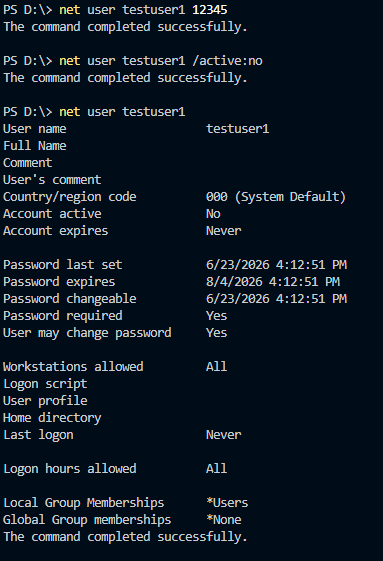

LOCAL USER MANAGEMENT

OBJECTIVE:
create & manage a local windows user account

COMMANDS USED:

net user
- used to get info on, create, or modify user account

OUTCOME:
confirmed account creation and modifications(deactivated/activated, change password) thru command

**WHY THIS MATTERS**:

IT support creates and manages user accounts frequently

