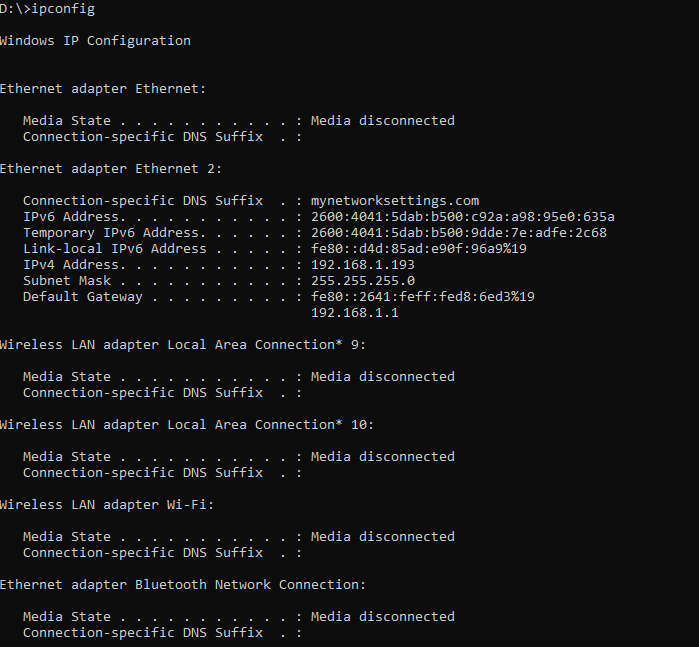
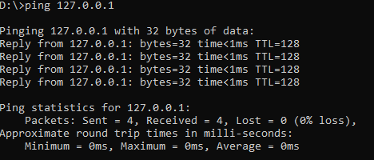
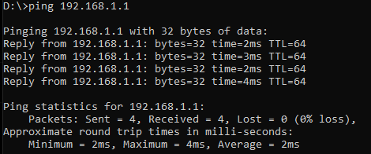
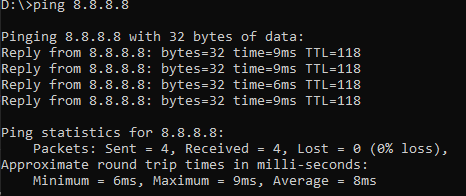
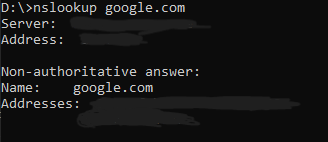

**BASIC NETWORK DIAGNOSTICS**

##OBJECTIVE

verify local network and internet connectivity

##1. IP CONFIGURATION

command:
 

shows:
-IPv4 address
-default gateway
-DNS servers

---

##2. LOCALHOST TEST

command:
 

verifies that TCP/IP stack is working

---

##3. GATEWAY TEST

command:
 

confirms connection to local router

---

##4. INTERNET TEST

command:
 

confirms external network connectivity

---

##5. DNS RESOLUTION TEST

command:
 
 
confirms DNS is resolving domain names correctly

---

##SUMMARY

these simulations demonstrate basic network troubleshooting steps used in IT support roles to diagnose connectivity